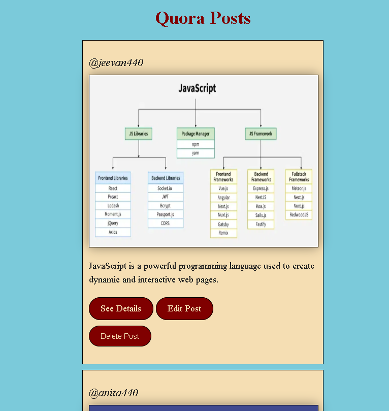
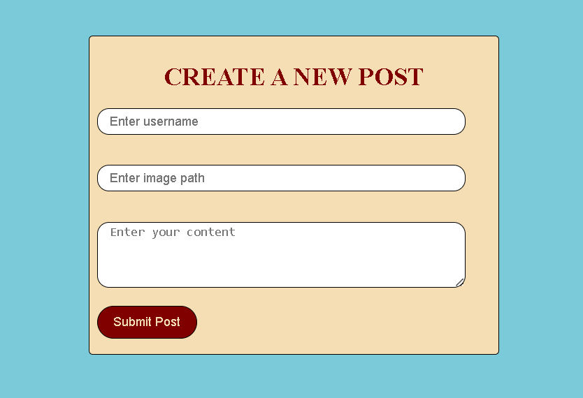
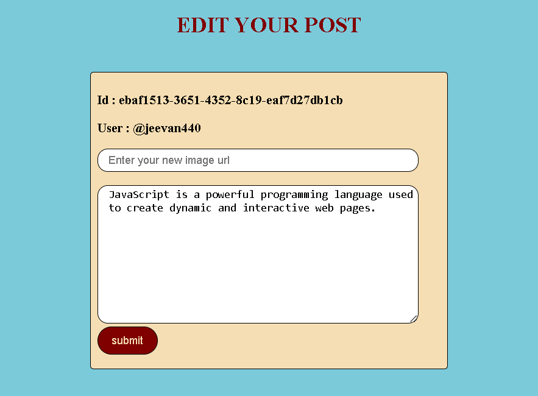
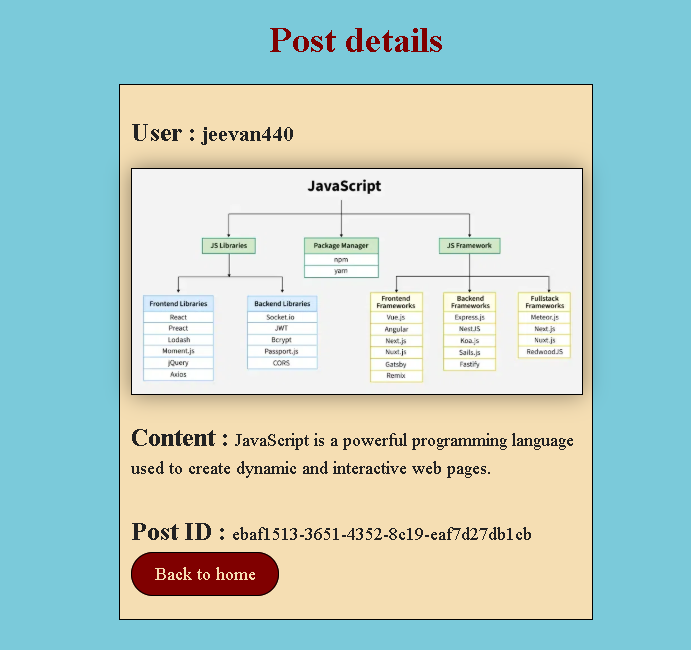

# Quora Post App

A simple Quora-like web application where users can create, read, update, and delete posts.  
Built with **Node.js, Express.js, and EJS**.  
Posts are stored in an in-memory **JavaScript array** (no database).

## Features
- Create, Read, Update, and Delete (CRUD) posts
- Dynamic rendering using EJS templates
- Data stored temporarily in arrays

## Tech Stack
- **Backend:** Node.js, Express.js
- **Frontend:** EJS, HTML, CSS
- **Database:** None (used JavaScript arrays for storage)
- **Version Control:** Git & GitHub

## 📂 Project Setup

Follow the steps below to run this project on your local machine:

```bash
# 1. Clone the repository
git clone https://github.com/jeevan400/Quora-Posts.git

# 2. Navigate to the project folder
cd Quora-Post

# 3. Install dependencies
npm install

# 4. Start the server
node index.js

##📸 Screenshots
#🏠 Homepage


#➕ Create Post


#✏️ Edit Post


# show Post


## Future Improvements
- Add database support (MongoDB or MySQL)
- Add user authentication
- Improve UI with Bootstrap/Tailwind

##Contributing
#Contributions are welcome!
- Feel free to fork this repo and submit a pull request.